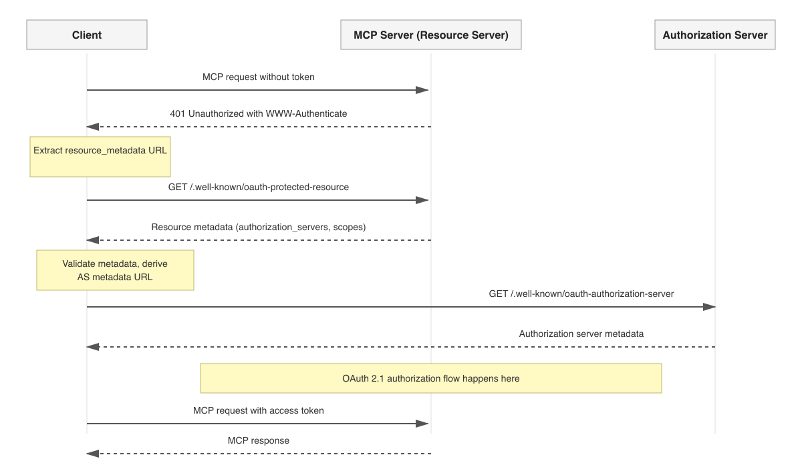
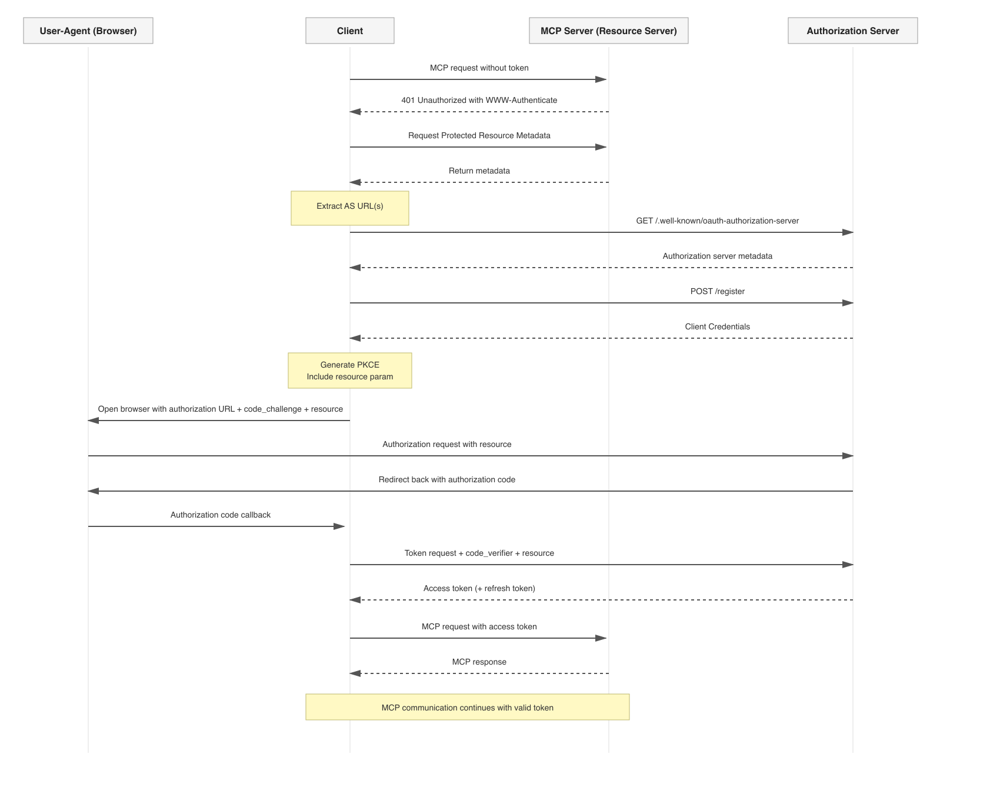

# Authorization and Dynamic Client Registration

This document explains how the Solesonic MCP Server implements the Model Context Protocol (MCP) Authorization flow and Dynamic Client Registration as described in the MCP Basic Authorization specification (2025-06-18):

- Spec link: https://modelcontextprotocol.io/specification/2025-06-18/basic/authorization

The server is implemented as an OAuth 2.0 Resource Server that accepts JWTs and challenges unauthenticated requests with a discoverable `WWW-Authenticate` header that points to its protected-resource metadata at `/.well-known/oauth-protected-resource`. That metadata advertises the authorization server(s) and scopes supported, enabling Dynamic Client Registration (DCR) and token acquisition by clients.


## Summary of how this implementation meets the MCP Authorization spec

- OAuth2 Resource Server with JWT validation:
  - Code: `src/main/java/com/solesonic/mcp/security/MpcSecurityConfig.java` lines 116–142.
  - Uses `JwtDecoder` (Nimbus) wired via `spring.security.oauth2.resourceserver.jwt.jwk-set-uri` or issuer configuration.
  - Converts authorities from three sources: `scope` (prefixed `SCOPE_`), `groups` → `GROUP_*`, `roles` → `ROLE_*`.
- Scope requirement for invoking MCP tools/endpoints:
  - Required authority prefix is `SCOPE_`; typical required scope is `MCP_INVOKE` (mapped to `SCOPE_MCP_INVOKE`).
  - See `MpcSecurityConfig.SCOPE_MCP_INVOKE` (lines 43–47) and method security in the app.
- Standards-compliant 401 challenge with discovery pointer:
  - On unauthorized access, returns 401 with `WWW-Authenticate` header set to `"<resource-base>/.well-known/oauth-protected-resource"`.
  - Code: `MpcSecurityConfig.authenticationEntryPoint()` lines 144–152.
  - CORS allows the `WWW-Authenticate` header so browsers/clients can read it.
    - Code: `MpcSecurityConfig` lines 49–57 (ALLOWED_HEADERS includes `WWW-Authenticate`).
- Protected Resource Metadata endpoint (well-known):
  - Path: `/.well-known/oauth-protected-resource`.
  - Code: `src/main/java/com/solesonic/mcp/api/ResourceMetadataController.java` lines 13–29.
  - Returns a `ProtectedResourceMetadata` object with:
    - `resource` → configured base resource identifier (`solesonic.mcp.resource`).
    - `authorization_servers` → list containing the configured `issuer-uri` (e.g., AWS Cognito or other OIDC-compliant AS).
    - `scopes_supported` → `openid`, `profile`, `email` (extend as needed).
- CORS and preflight support for HTTP transport (JSON-RPC over HTTP):
  - Allows methods `GET`, `POST`, `OPTIONS`; permits preflight for `/mcp/**` and well-known endpoint.
  - Code: `MpcSecurityConfig.securityFilterChain()` lines 116–142 and CORS bean lines 100–114.


## Key endpoints and headers

- MCP endpoint (HTTP transport): `POST /mcp`
- Well-known resource metadata: `GET /.well-known/oauth-protected-resource`
- 401 Challenge header (unauthenticated request to a protected endpoint):
  - `WWW-Authenticate: "<resource-base>/.well-known/oauth-protected-resource"`

`<resource-base>` is taken from `solesonic.mcp.resource` (see Configuration section).


## Authorization flow (high level)

1) Client attempts to call the MCP endpoint without a valid token.
2) Server responds with HTTP 401 and a `WWW-Authenticate` header pointing to the well-known metadata.
3) Client fetches `/.well-known/oauth-protected-resource` to discover the Authorization Server and scopes.
4) Client performs Dynamic Client Registration (if not already registered) with the Authorization Server it discovered.
5) Client obtains an access token (e.g., via OAuth 2.0/OIDC flows) with the required scope(s), typically `MCP_INVOKE`.
6) Client calls the MCP endpoint again with `Authorization: Bearer <access_token>` and succeeds if the token is valid and authorized.


### Sequence diagram: Authorization challenge + discovery + token use


## Dynamic Client Registration (DCR)

This server supports DCR indirectly by advertising the protected resource metadata—specifically the `resource` identifier and the `authorization_servers`—that a client needs in order to register with the AS. The registration itself is performed with the Authorization Server, not by this resource server.

- Metadata for DCR is exposed at `/.well-known/oauth-protected-resource`.
- The `authorization_servers` array includes the configured OIDC issuer URI (e.g., Cognito, Okta, Keycloak).
- Clients should consult the issuer’s OIDC configuration to locate its Dynamic Client Registration endpoint and register there.

### Sequence diagram: Dynamic Client Registration



## Example: Unauthorized request and discovery

- Unauthorized request to `/mcp`:

```
curl -i -X POST \
  -H 'Content-Type: application/json' \
  http://localhost:8080/mcp
```

Example response (abbreviated):

```
HTTP/1.1 401 Unauthorized
WWW-Authenticate: "https://api.your-domain.example/.well-known/oauth-protected-resource"
Content-Type: application/json
```

- Discover metadata:

```
curl -s http://localhost:8080/.well-known/oauth-protected-resource | jq .
```

Example JSON response:

```
{
  "resource": "https://api.your-domain.example",
  "authorization_servers": [
    "https://<your-domain>.auth.<region>.amazoncognito.com"
  ],
  "scopes_supported": [
    "openid",
    "profile",
    "email"
  ]
}
```


## Example: Authorized request

Once your client is registered with the AS and has obtained a token containing the required scope(s):

```
curl -i -X POST \
  -H 'Authorization: Bearer <ACCESS_TOKEN>' \
  -H 'Content-Type: application/json' \
  http://localhost:8080/mcp \
  -d '{"jsonrpc":"2.0","id":"1","method":"ping","params":{}}'
```

A valid token with `scope` including `MCP_INVOKE` (or the server’s configured scope) is required.


## Configuration

These properties are used to control the authorization and discovery behavior. They can be set in `application.properties` or via environment variables (Spring Dotenv loads `.env`; OS env vars override):

- `spring.security.oauth2.resourceserver.jwt.issuer-uri=${ISSUER_URI}`
  - The OIDC issuer URI for the Authorization Server (e.g., Cognito, Okta, Keycloak). Also used in the well-known metadata `authorization_servers`.
- `spring.security.oauth2.resourceserver.jwt.jwk-set-uri` (optional)
  - Direct JWKS URI for token verification (when not using issuer discovery). If set, used by the `JwtDecoder`.
- `solesonic.mcp.resource`
  - The base resource identifier (e.g., `https://api.your-domain.example`).
  - Used in `WWW-Authenticate` to point clients to `"<resource>/.well-known/oauth-protected-resource"` and returned as `resource` in the metadata.
- `cors.allowed.origins`
  - Origins permitted for browser-based clients.

Related configuration and code references:

- Well-known metadata controller: `src/main/java/com/solesonic/mcp/api/ResourceMetadataController.java` (lines 13–29)
- Security configuration: `src/main/java/com/solesonic/mcp/security/MpcSecurityConfig.java` (lines 37–160)
- Authorities extraction (groups/roles): `src/main/java/com/solesonic/mcp/security/AuthoritiesService.java` (lines 12–51)


## Scopes, groups, and roles

- Scopes: The JWT `scope` claim is converted to Spring authorities with prefix `SCOPE_`. A scope of `MCP_INVOKE` becomes `SCOPE_MCP_INVOKE`.
- Groups: If a token includes a `groups` claim, each value becomes `GROUP_<NAME>` authority.
- Roles: If a token includes a `roles` claim, each value becomes `ROLE_<NAME>` authority.

This allows fine-grained access control in addition to scope checks. Ensure your Authorization Server issues the appropriate claims.


## CORS and browsers

To facilitate browser-based clients discovering the metadata and reading the challenge header:

- CORS allows methods: `GET`, `POST`, `OPTIONS`.
- Allowed headers include `WWW-Authenticate`, `Authorization`, and `Content-Type`.
- Preflight requests to `/mcp/**` and the well-known endpoint are permitted.

Code references:
- `MpcSecurityConfig.corsConfigurationSource()` and `securityFilterChain()`.


## Security considerations

- Only trusted Authorization Servers should be listed in `authorization_servers`.
- Use TLS in production. See `application-ssl.properties` for example SSL configuration.
- Do not log or expose tokens. This project uses SLF4J logging and avoids printing secrets.
- Audience and scope enforcement should be configured in your Authorization Server (e.g., audience `api://solesonic-mcp`) and reflected in tokens issued to clients.


## FAQ

- Q: Does the resource server handle the client registration itself?
  - A: No. It exposes the protected-resource metadata required for clients to locate the Authorization Server and complete Dynamic Client Registration with that server.

- Q: What is the minimal scope required?
  - A: Typically `MCP_INVOKE`. You may add additional scopes if you want narrower permissions; ensure your server-side checks align with your policy.

- Q: How do I change the displayed issuer or resource in the metadata?
  - A: Set `ISSUER_URI` and `solesonic.mcp.resource` in your environment or properties files.
